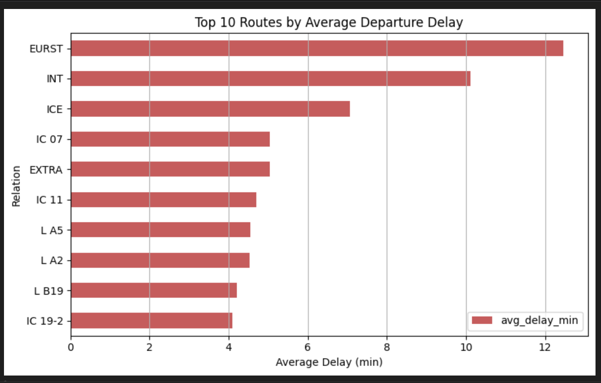
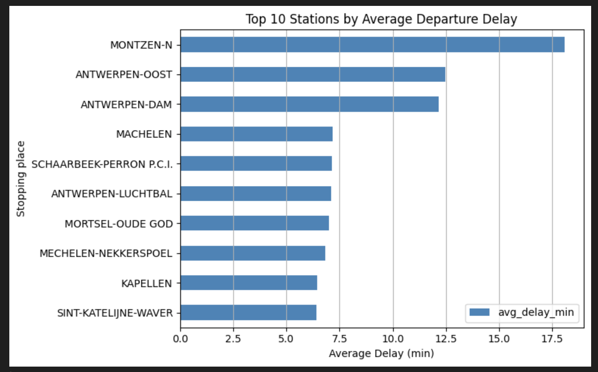
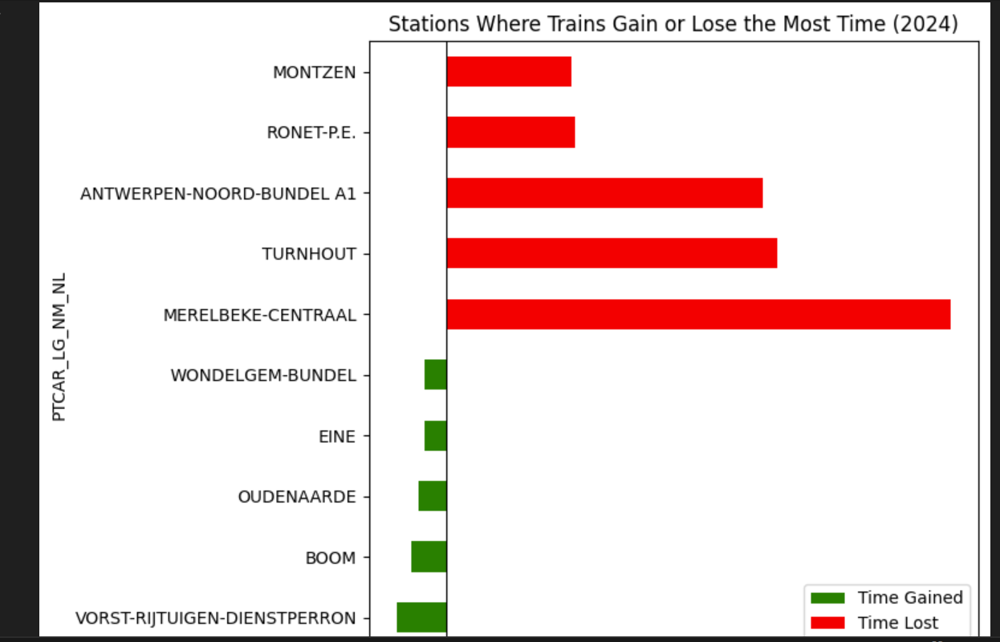

# 🚆 NMBS Train Punctuality Analysis – Realistic Insights from Open Data

**Business Question**  
NMBS publishes an official punctuality rate of ~91–92%. Is this realistic when we look at actual departure times? And where exactly do trains lose or gain time during stops?

**My Solution**  
End-to-end analysis in Python (Pandas) on real 2024–2025 NMBS open data. I calculated a more realistic punctuality rate and identified stations with the highest time loss/gain.

**Key Findings (May 2025 data)**
- Official NMBS punctuality: **91.51%**
- Realistic punctuality (actual departure < 6 min late): **87.87%**
- Difference: **−3.65 percentage points**
- Top stations losing time: Merelbeke-Centraal (707 min avg), Turnhout, Antwerpen-Noord-Bundel A1…
- Top stations gaining time: Vorst-Rijtuigen-Dienstperron (−70 min), Boom, Oudenaarde…

**Technologies Used**
- Python (Pandas, Matplotlib/Seaborn)
- Data cleaning & datetime processing
- Aggregation & KPI calculation
- (Optional: Power BI dashboard – see screenshots below)

**Repository Structure**
- `train_delays.ipynb` → full analysis
- `data/` → raw + cleaned CSVs (NMBS open data)
- `requirements.txt`

**Visualisations**  

## Business Impact & Recommendations
- Revealed a consistent **3.65 percentage point gap** between NMBS official punctuality and real passenger    experience.
- Pinpointed high-impact stations (e.g. Merelbeke-Centraal, Turnhout, Antwerpen-Noord-Bundel A1) where targeted operational improvements could reduce average delays.
- Ready-to-use insights for NMBS performance dashboards, scheduling optimisation, or customer communication.

**How to run**  
1. `pip install -r requirements.txt`  
2. Open `train_punctuality.ipynb`
3. open `train_time_gain&_lost.ipynb`